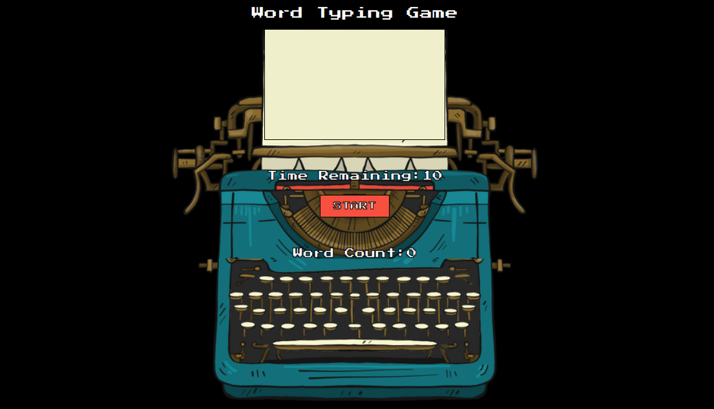

# Speed Typing Game

This project was created based on the code of Bob Ziroll's course called "The React Bootcamp" (https://scrimba.com/learn/react).
The objective is to check how many words can you type in 10 seconds. Have fun!

## Live Demo

[Live Demo Link](https://speedtypealex.netlify.app/)

## Getting Started

To get a local copy up and running follow these simple example steps.

- Git clone git@github.com:abouhid/SpeedTypingGame.git
- Move to the root directory in your command line
- run `npm install`
- run `npm start`

### Hot To Play

- Click the "Start" button for the game to start
- The textarea is disabled before starting the game, so no cheating!
- Type as many words as you can.
- Share and challenge your friends!

## Authors

👤 **Alexandre Bouhid**

- Github: [@abouhid](https://github.com/abouhid)
- LinkedIn: [Alexandre Bouhid](https://www.linkedin.com/in/alexandrebouhid/)

## 🤝 Contributing

Contributions, issues and feature requests are welcome!

## Show your support

Give a ⭐️ if you like this project!

## 📝 License

This project is [MIT](lic.url) licensed.